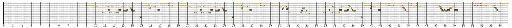

# Humidifier

Humidifier is a tool to normalise the key of a MIDI file and plot the result as
a piano roll.

It was built for visually comparing vocal lines between different songs - quite
a niche!

Should work out of the box with Haskell Stack or Cabal.

## Example Output

